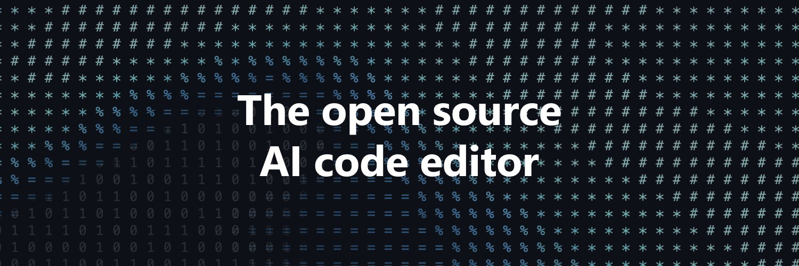

# VS Code Dev Days

La série d'événements **VS Code Dev Days** est une initiative mondiale de groupes d'utilisateurs, organisée en présentiel en septembre. Notre objectif est de rassembler les développeurs, passionnés et communautés locales pour explorer la puissance de Visual Studio Code et GitHub Copilot dans le développement autonome par l'IA.

Les VS Code Dev Days sont **ouverts à tous les développeurs** et mettent l'accent sur le **codage assisté par l'IA** avec GitHub Copilot. Ces **ateliers en présentiel** auront lieu partout dans le monde en **septembre 2025**, dureront de 2,5 à 3 heures et seront animés par des communautés techniques locales.

### 🗓️ Format de l'événement

Les **VS Code Dev Days @ Gembloux, Belgique** sont conçus pour être une expérience pratique, permettant aux participants d'apprendre en faisant.  
**L'agenda de l'événement doit suivre la structure standard ci-dessous.**

| #  | Heure | Sujet | Durée | Orateur | Ressources  |
|----|-----|----------------------------------------------------|--------------|-----------------------------------------------------------------------------|--------------------------|
| 00 | 17h00 | Accueil & Networking | 30 min. | 
| 01 | 17h30 | Démarrez avec GitHub Copilot dans VS Code. | 45 min. | Denis Voituron (Microsoft)| [📁 **Dossier Content**](/content/)    |
| 02 | 18h15 | Comment évaluer le modèle qui convient au mieux à vos besoins de dev ? | 20 min. | Leila Rebbouh (Onyrix) |   |
| 03 | 18h35 | Les MCP dans VS Code : Comment sur-vitaminer votre éditeur de code  | 20 min. | Adrien Clerbois (Microsoft MVP) |   |
| 04 | 19h00 | Atelier | 60 min. | Christophe Peugnet    | [📁 **Dossier Content**](/content/) |
| 05 | 20h00 | Drink & networking 🍻 | 20 min. |  |

**Pour retrouver facilement ce dépôt plus tard, vous pouvez aussi [ajouter une étoile (🌟) à ce repo](https://docs.github.com/en/get-started/exploring-projects-on-github/saving-repositories-with-stars).**

### 📚 Ressources disponibles

| Sujet | Description | Ressources |
| :--- | :--- | :--- |
| 📁 [**Contenu**](/content) | Contenu technique pour les sessions et ateliers. | Slides de présentation, ateliers pratiques |
| 📁 [**Guide d'organisation**](/organization) | Guide étape par étape pour planifier, organiser et réussir vos événements, avec checklists et modèles. | Checklist événement, brouillon page d'inscription |
| 📁 [**Matériel promotionnel**](/marketing) | Kit marketing pour promouvoir votre événement, avec des modèles pour les réseaux sociaux et des textes de référence. | Visuels d'événement, modèles réseaux sociaux |

## Contribution

Ce projet accueille volontiers les contributions et suggestions. La plupart des contributions nécessitent d'accepter un
Contributor License Agreement (CLA) déclarant que vous avez le droit de nous accorder l'utilisation de votre contribution. Pour plus de détails, consultez [https://cla.opensource.microsoft.com](https://cla.opensource.microsoft.com).

Lorsque vous soumettez une pull request, un bot CLA déterminera automatiquement si vous devez fournir un CLA et annotera la PR en conséquence (ex : vérification de statut, commentaire). Suivez simplement les instructions du bot. Vous n'aurez à le faire qu'une seule fois pour tous les dépôts utilisant notre CLA.

Ce projet a adopté le [Code de Conduite Open Source Microsoft](https://opensource.microsoft.com/codeofconduct/).
Pour plus d'informations, consultez la [FAQ du Code de Conduite](https://opensource.microsoft.com/codeofconduct/faq/) ou contactez [opencode@microsoft.com](mailto:opencode@microsoft.com) pour toute question ou commentaire supplémentaire.

## Marques déposées

Ce projet peut contenir des marques ou logos pour des projets, produits ou services. L'utilisation autorisée des marques ou logos Microsoft est soumise et doit respecter les [Directives d'utilisation des marques et de la marque Microsoft](https://www.microsoft.com/en-us/legal/intellectualproperty/trademarks/usage/general).
L'utilisation des marques ou logos Microsoft dans des versions modifiées de ce projet ne doit pas prêter à confusion ou impliquer un parrainage de Microsoft.
Toute utilisation de marques ou logos de tiers est soumise aux politiques de ces tiers.
